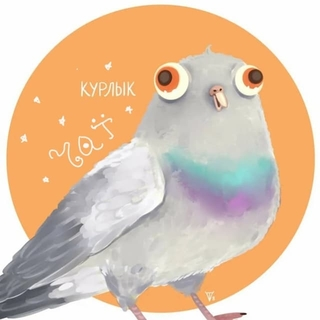

# Курлык чат

   

Экспериментальный чат[площадка], для интересных фич :)  
Курлык! Kurlyk!

## Как запустить
- `yarn` - установка зависимостей
 
### Продакшн сборку
- `yarn build` - сборка проекта
- `yarn start` - запуск сервера

### Дев сборку
- `yarn server:build` - сборка бэка
- `yarn run dev` - запуск фронта(на 127.0.0.1)
